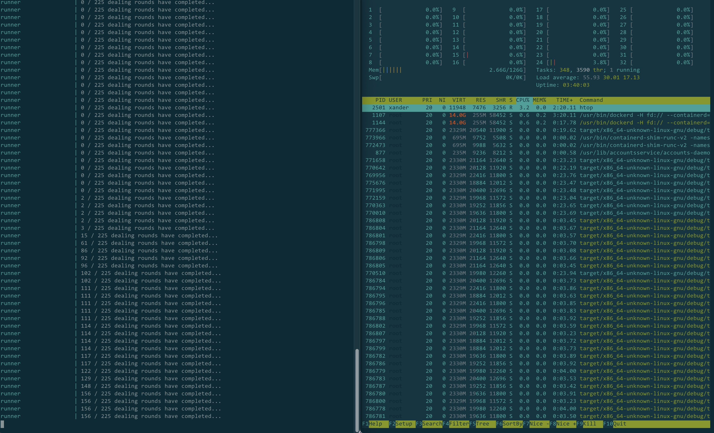

A minimal reproducing sample of some unexpected CPU usage with tonic/tokio gRPC bidirectional streams.

### Setup
- This has been tested on Ubuntu 20.04
- The multi-node run (./run.sh) requires Docker and Docker Compose:
- Install Docker:
```
sudo apt-get install \
    ca-certificates \
    curl \
    gnupg \
    lsb-release
curl -fsSL https://download.docker.com/linux/ubuntu/gpg | sudo gpg --dearmor -o /usr/share/keyrings/do  cker-archive-keyring.gpg
echo \
  "deb [arch=$(dpkg --print-architecture) signed-by=/usr/share/keyrings/docker-archive-keyring.gpg] ht  tps://download.docker.com/linux/ubuntu \
  $(lsb_release -cs) stable" | sudo tee /etc/apt/sources.list.d/docker.list > /dev/null
sudo apt-get update
sudo apt-get install docker-ce docker-ce-cli containerd.io
sudo systemctl start docker # Docker will start automatically on future system boots
```
- Install Docker Compose v2:
```
DOCKER_CONFIG=${DOCKER_CONFIG:-$HOME/.docker}
mkdir -p $DOCKER_CONFIG/cli-plugins
curl -SL https://github.com/docker/compose/releases/download/v2.4.1/docker-compose-linux-x86_64 -o $DO  CKER_CONFIG/cli-plugins/docker-compose
chmod +x $DOCKER_CONFIG/cli-plugins/docker-compose
docker compose version
```
- Set Docker to run without `sudo`:
```
sudo groupadd docker
sudo usermod -aG docker $USER
sudo reboot
docker run hello-world # This should work without sudo now
```

### Run
- `./run.sh` to build the binary and run the network of nodes. Define the number of nodes in the network in the .env file. By default this creates 75 nodes in a fully connected mesh network and attempts to create and share 225 dealings between every node. Run `htop` in another tab. Notice that when the dealings begin, processor usage is at 100%, then at some point it will suddenly die to 0% CPU usage and eventually kick back up to 100% usage until it completes. Example during a run where CPU usage has gone to 0%:

